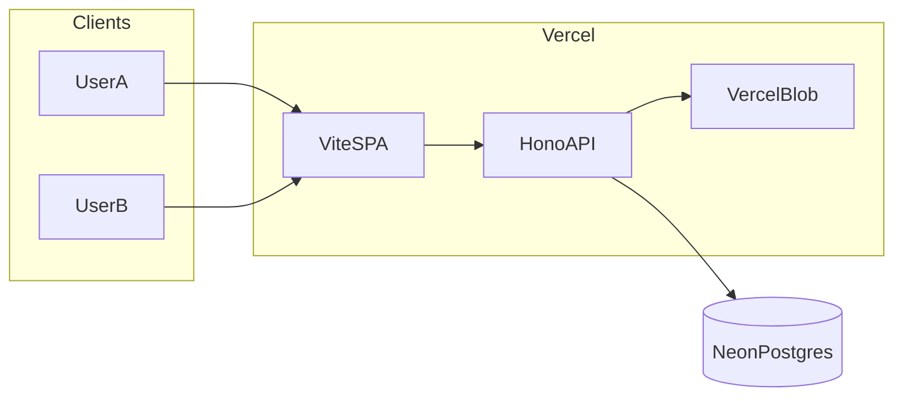
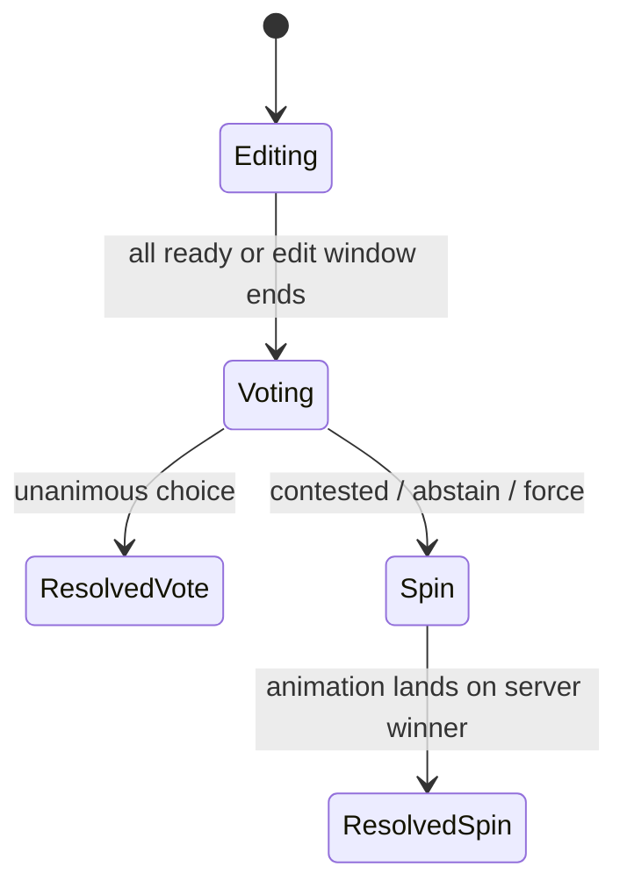

# Album — architecture

| Piece | Role |
| --- | --- |
| Neon `albums` | Per-member durable pixels / cover URL |
| Neon `album_votes` / `album_contests` | Votes + winner |
| Blob `cover_url` | Rendered PNG preview |
| Hono `/sessions/:id/album*` | Membership, edit, ready, vote, resolve |
| Client poll | Peer ready / contest state (no WS) |

## Lifecycle

