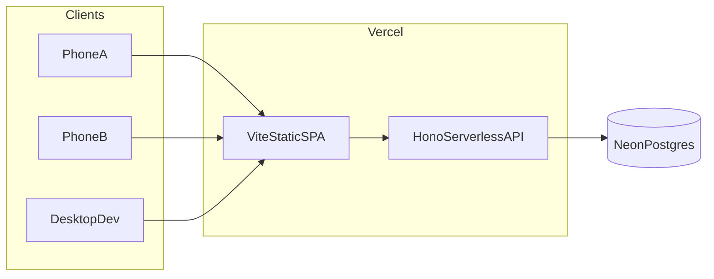
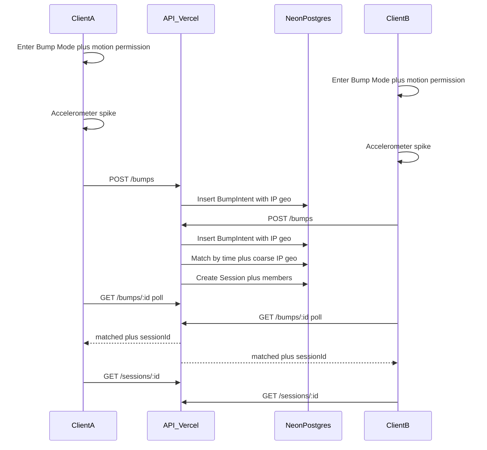
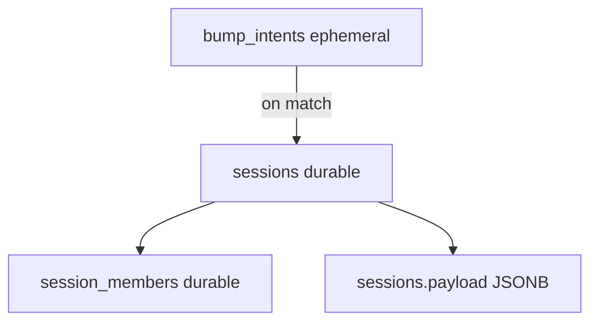

# Bump — architecture

## Core insight

The bump **gesture** lives on the frontend; **pairing and session** live on the backend. Clients cannot exchange info peer-to-peer just because both shook — the server is the rendezvous.

## Deploy topology

| Piece | Choice | Why |
| --- | --- | --- |
| Frontend | Vite + React + TS on Vercel | Static SPA |
| API | Hono via Vercel serverless | Same deploy; no second host for MVP |
| DB | Neon Postgres | Shared state across ephemeral functions |
| Match notify | Short polling in Bump Mode only | Serverless-safe; no long-lived WS |
| Canvas later | PartyKit / Ably / Fly WS | Attach to existing `sessionId` |

## Bump match sequence

## Data lifetime

- `bump_intents` — short-lived matching queue (seconds)
- `sessions` + `session_members` — product source of truth for connections
- `sessions.payload` — flexible nested profile/photo data without a document DB

## Monorepo layout

- `apps/web` — Vite React client
- `apps/api` — Hono API (local Node + shared by Vercel entry)
- `api/[[...route]].ts` — Vercel serverless catch-all → Hono (`/api/*`)
- `packages/shared` — shared types and Zod schemas

See also [Vercel frontend ↔ backend map](../deploy-vercel.md).
