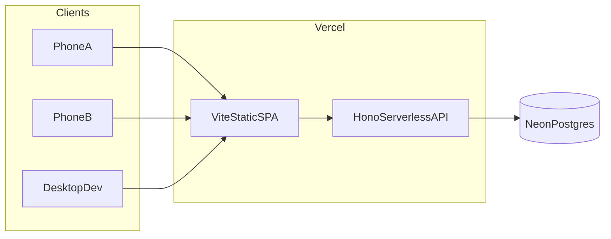
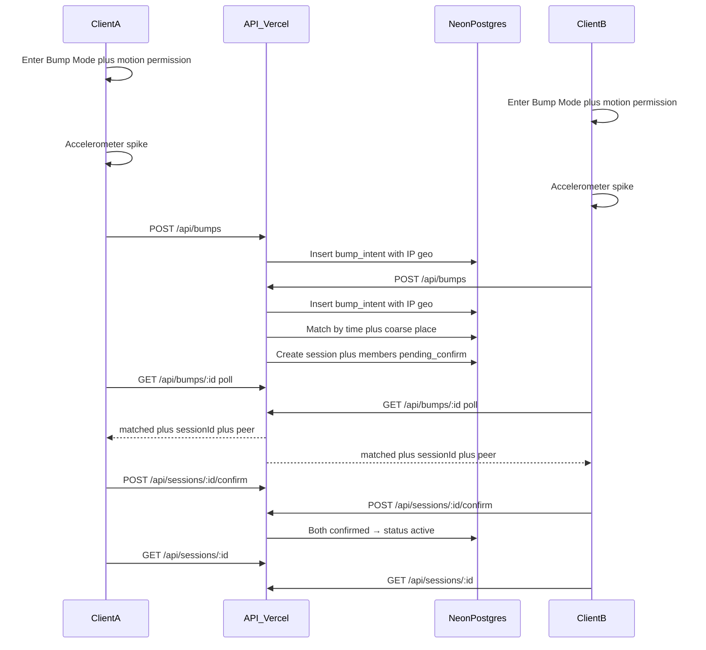
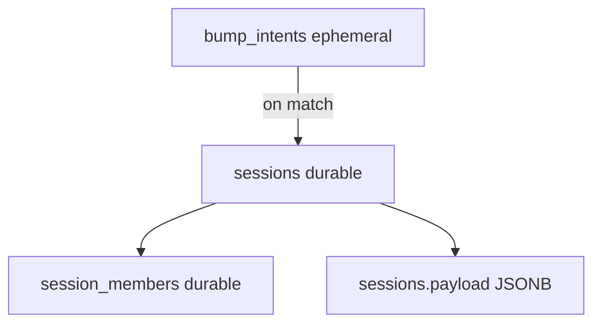

# Bump — architecture

## Core insight

The bump **gesture** lives on the frontend; **pairing and session** live on the backend. Clients cannot exchange info peer-to-peer just because both shook — the server is the rendezvous.

## Deploy topology

| Piece | Choice | Why |
| --- | --- | --- |
| Frontend | Vite + React + TS on Vercel | Static SPA |
| API | Hono via Vercel serverless | Same deploy; no second host for MVP |
| DB | Neon Postgres | Shared state across ephemeral functions |
| Local without Neon | In-memory when `DATABASE_URL` unset | Two-tab local OK; Preview/Prod need Neon for two phones |
| Match notify | Short polling in Bump Mode only (~500ms) | Serverless-safe; no long-lived WS |
| Auth MVP | Bearer token = user id | Bootstrap only; replace with JWT later |
| Canvas / album cover | Per-user covers + poll (see [album](../album/architecture.md)) | Attach to `sessionId`; no long-lived WS on Vercel |

Frontend calls **same-origin** `fetch('/api' + path)`. Recreate / Preview Neon / env switch: [../deploy-vercel.md](../deploy-vercel.md) and root `README.md`.

## Bump match sequence

Match may complete on either the second `POST` or a subsequent poll (`tryMatchBump` runs on both). First arriver often stays `pending` until the peer’s request or poll pairs them.

## Data lifetime

- `bump_intents` — short-lived matching queue (seconds)
- `sessions` + `session_members` — product source of truth for connections
- `sessions.payload` — flexible nested profile/photo data without a document DB

## Store selection

| Environment | `DATABASE_URL` | Store |
| --- | --- | --- |
| Local `npm run dev` | unset | In-memory (per process) |
| Local with Neon | set | Neon (same code as Vercel) |
| Vercel Preview/Production | must be set for two devices | Neon |

No separate `USE_REMOTE_DB` flag — presence of `DATABASE_URL` is the switch (`GET /api/health` reports `store`).

## Monorepo layout

- `apps/web` — Vite React client (`features/bump`, `features/session`)
- `apps/api` — Hono API (local Node + shared by Vercel entry); stores in `src/db/`
- `api/index.ts` — Vercel serverless entry; `vercel.json` rewrites `/api/(.*)` → `/api`
- `packages/shared` — shared constants, types, Zod schemas

### Vercel entry gotchas (do not reintroduce)

1. Not Next.js — use `api/index.ts` + rewrite, not `api/[[...route]].ts`
2. Export named `GET` / `POST` / … from `hono/vercel` `handle(app)`
3. Root `"type": "module"`
4. Dynamic `import("../apps/api/src/app.js")` to avoid `ERR_REQUIRE_ESM`
5. Neon HTTP match SQL needs `::text` / `::float8` casts on params

See [../deploy-vercel.md](../deploy-vercel.md).
