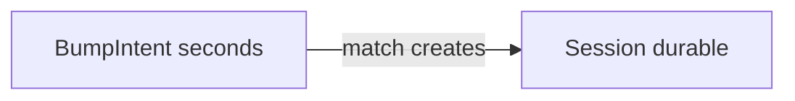

# Bump — data model

Postgres on Neon (or in-memory mirror of the same shapes). Relations are first-class; flexible blobs use JSONB. Schema: `apps/api/src/db/schema.ts`.

## Tables

### `users`

| Column | Type | Notes |
| --- | --- | --- |
| id | uuid PK | Also MVP auth token |
| display_name | text | |
| avatar_url | text nullable | |
| device_id | text nullable unique | Lightweight resume key (`localStorage`) |
| created_at | timestamptz | |

### `bump_intents` (ephemeral)

| Column | Type | Notes |
| --- | --- | --- |
| id | uuid PK | |
| user_id | uuid FK | |
| client_timestamp | timestamptz | From device; not primary match clock |
| server_timestamp | timestamptz | Primary match clock |
| ip | text | |
| geo_city / region / country | text nullable | From Vercel headers or `DEV_GEO_*` |
| geo_lat / geo_lng | double nullable | |
| peak_magnitude | double nullable | Client UX signal |
| idempotency_key | text | Unique per user |
| status | text | `pending` \| `matched` \| `expired` |
| matched_bump_id | uuid nullable | Partner intent |
| session_id | uuid nullable | Set on match |
| expires_at | timestamptz | ~8s after create |

### `sessions` (durable)

| Column | Type | Notes |
| --- | --- | --- |
| id | uuid PK | |
| created_via | text | `bump` |
| status | text | `pending_confirm` \| `active` \| `closed` |
| payload | jsonb | Profile snapshots, photo URLs, notes |
| created_at | timestamptz | |

**Payload shape** (Zod in `@summerhacks/shared`):

```json
{
  "profiles": [
    {
      "userId": "...",
      "displayName": "...",
      "avatarUrl": null,
      "photoUrls": []
    }
  ],
  "notes": "Connected via bump"
}
```

### `session_members`

| Column | Type | Notes |
| --- | --- | --- |
| session_id | uuid FK | |
| user_id | uuid FK | |
| joined_at | timestamptz | |
| confirmed_at | timestamptz nullable | Null until `POST .../confirm` |

Primary key `(session_id, user_id)`. Session becomes `active` when every member has `confirmed_at`.

## Lifetimes



**UX source of truth = sessions**, not bumps. Recent connections list sessions; bump intents are a matching queue that can be expired/GC’d later without losing connections.

## Verifying a match in Neon

After a successful two-device (or mock) bump:

```sql
SELECT id, status, created_at, payload
FROM sessions
ORDER BY created_at DESC
LIMIT 5;

SELECT bi.status, bi.session_id, bi.geo_city, u.display_name
FROM bump_intents bi
JOIN users u ON u.id = bi.user_id
ORDER BY bi.server_timestamp DESC
LIMIT 10;
```

Expect a shared `session_id`, both intents `matched`, session `pending_confirm` until both users confirm (then `active`).
