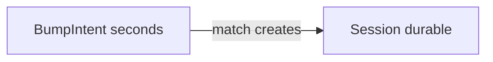

# Bump — data model

Postgres on Neon. Relations are first-class; flexible blobs use JSONB.

## Tables

### `users`

| Column | Type | Notes |
| --- | --- | --- |
| id | uuid PK | |
| display_name | text | |
| avatar_url | text nullable | |
| device_id | text nullable unique | Lightweight resume key |
| created_at | timestamptz | |

### `bump_intents` (ephemeral)

| Column | Type | Notes |
| --- | --- | --- |
| id | uuid PK | |
| user_id | uuid FK | |
| client_timestamp | timestamptz | |
| server_timestamp | timestamptz | Primary match clock |
| ip | text | |
| geo_city / region / country | text nullable | From Vercel headers |
| geo_lat / geo_lng | double nullable | |
| peak_magnitude | double nullable | |
| idempotency_key | text | Unique per user |
| status | text | pending \| matched \| expired |
| matched_bump_id | uuid nullable | |
| session_id | uuid nullable | |
| expires_at | timestamptz | |

### `sessions` (durable)

| Column | Type | Notes |
| --- | --- | --- |
| id | uuid PK | |
| created_via | text | `bump` |
| status | text | pending_confirm \| active \| closed |
| payload | jsonb | Profile snapshots, photo URLs, etc. |
| created_at | timestamptz | |

### `session_members`

| Column | Type | Notes |
| --- | --- | --- |
| session_id | uuid FK | |
| user_id | uuid FK | |
| joined_at | timestamptz | |
| confirmed_at | timestamptz nullable | |

Primary key `(session_id, user_id)`.

## Lifetimes

**UX source of truth = sessions**, not bumps. Recent connections list sessions; bump intents are a matching queue.
